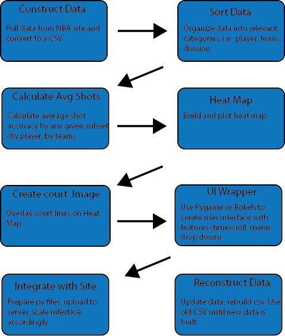
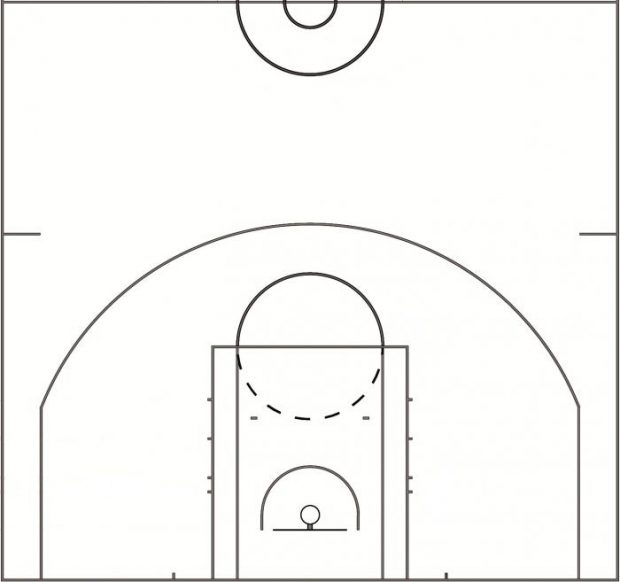

By Maya Calabria, Bryce Mann, and Juan Carlos del Rio
Software Design, Olin College of Engineering, Spring 2018

***

# Project Goals

As avid followers of the sport the main movtivation of this project was to create an easy way for people to understand the shooting and scoring dynamics of a sport that has meticulously been gathering this data since 1995. Throught this project we hoped to learn about the process of creating compeling vissuals that help illustrate the story that this data has to tell. Adittionally, in accorance with the spirit of this project we wanted to provide a beautiful, accessible, and intuitve graphic user interface that would help potential users navigate through the vast amounts of data. Lastly, it was our intention to host this tool as a webapp that would allow other basketball fans  arround the world could have access to this well of information currently quitely stitting deep within the NBA’s dtatabase. 

***

#Data Collection and Processing

## NBA.com

The NBA hosts and upates shot statistics for every player and every game on their website, however the data is formated as a large, hard to read table that does not display a lot of the more specific datasets. In order to obtain specific shot locations, for example, one needs to obtain the JSON file where the data is stored. Then using the naming convention for the palyer ID and year you can access the individual data for every shot in every game throughout the year a specific player. In order to integrate with this database we were able to find a script online that could pull this data and make a sorted dictionary with the data. We then wrote a wrapper that could write said data to a csv witht he player’s name and year.

## Python Heat Map Plots

We then proceeded to use this data to plot het maps. (We will write more about this process later as we are currently changing our approach)

# Results

## Example Plots

## Integrated Webapp

[FULLY FUNCTIONAL Shot Data Webapp](https://www.youtube.com/watch?v=dQw4w9WgXcQ)

### To Install before use

$pip install nba_py

$pip install plotly

$pip install numpy

$pip install scipy

$python -m pip install matplotlib

$sudo apt-get install python3-pandas

$pip install bokeh
